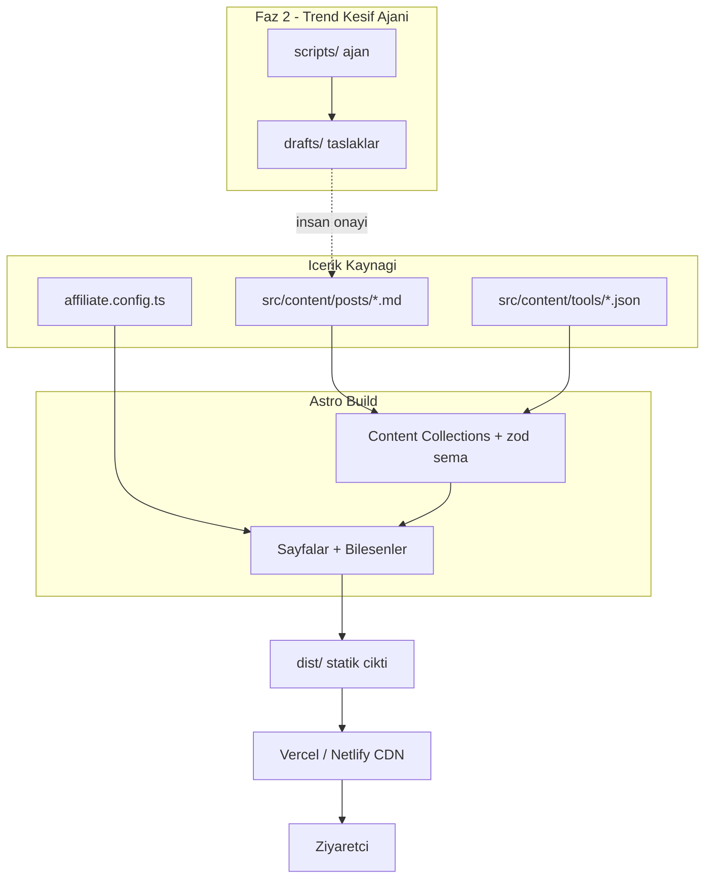
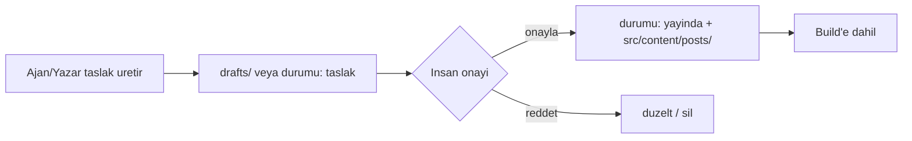

# ARCHITECTURE

> Son güncelleme: 2026-06-14

## Genel Bakış
Astro tabanlı statik site (SSG). İçerik dosya tabanlı (Markdown/MDX + JSON), build zamanında derlenir. Çalışma zamanında sunucu yok; CDN'den statik servis. Faz 2'de ayrık bir Node.js ajanı (CI cron) yalnızca taslak üretir — siteye yayın yapmaz.

## Sistem Mimarisi



## Editöryel Veri Akışı


**Kural:** Yalnızca `durumu: yayinda` olan içerik listelenir/build'e girer. Otomatik yayın yoktur.

## Servisler / Bileşenler
- **Layout'lar:** `BaseLayout` (head/SEO, header, footer), `PostLayout` (yazı şablonu).
- **Bileşenler:** `BaseHead` (meta/OG/canonical/JSON-LD), `Header`, `Footer`, `PostCard`, `ToolCard`, `AffiliateLink` (+ `rel`), `AffiliateDisclosure`, `AdSlot` (placeholder), `NewsletterSignup` (placeholder).
- **İçerik:** `src/content/config.ts` — `posts` ve `tools` koleksiyonları (zod şema).
- **Affiliate:** `affiliate.config.ts` — araç anahtarı → `{ url, komisyonNotu }`.

## Veri Akışı (API)
Faz 1'de harici çağrı yok. İç akış: Markdown frontmatter → zod doğrulama → tipli içerik → sayfa render. Şema detayı `API.md`.

## Yetkilendirme Modeli
Faz 1: yok (kamuya açık statik site, kullanıcı hesabı yok). Editöryel onay = depo yazma yetkisi olan insan (git). Faz 2 ajanı yalnızca `drafts/` yazma kapsamında.

## Güvenlik Modeli
Gizli anahtarlar env'de; statik çıktıya yalnızca `PUBLIC_` öneki sızar. Affiliate `rel="sponsored nofollow"`. Form girdisi doğrulama. Detay `SECURITY.md`.

## Hata Yönetimi & Loglama
Build zamanı: zod şema hatası build'i durdurur (sessiz hatalı içerik engellenir). Runtime statik olduğu için minimal. Faz 2 ajanı yapılandırılmış log + başarısız kaynak için graceful skip.

## Ölçeklenebilirlik Planı
İçerik büyürse: artımlı build, görsel CDN, gerekirse içerik DB'si (SQLite/Turso). CDN dağıtımı yatay ölçeği sağlar.

## Klasör Yapısı
```
/src
  /content/config.ts        # koleksiyon şemaları
  /content/posts/*.md       # yayınlanmış yazılar
  /content/tools/*.json     # araç dizini verisi
  /components/*.astro
  /layouts/*.astro
  /pages
    index.astro
    posts/[...slug].astro
    kategori/[category].astro
    araclar.astro
    hakkinda.astro
    gizlilik.astro
    affiliate-aciklama.astro
    robots.txt.ts
  /lib                      # yardımcılar (affiliate çözümleme vb.) + testler
/drafts                     # Faz 2 ajan taslakları
/scripts                    # Faz 2 ajan
/.github/workflows          # CI + (Faz 2) cron
affiliate.config.ts
```
Yeni klasör gerektiğinde bu dosya güncellenir (AI ajan kuralı #10).
